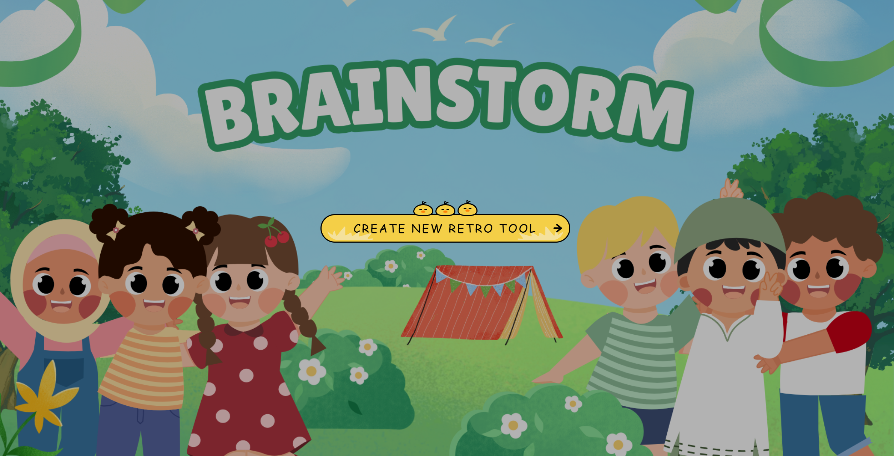
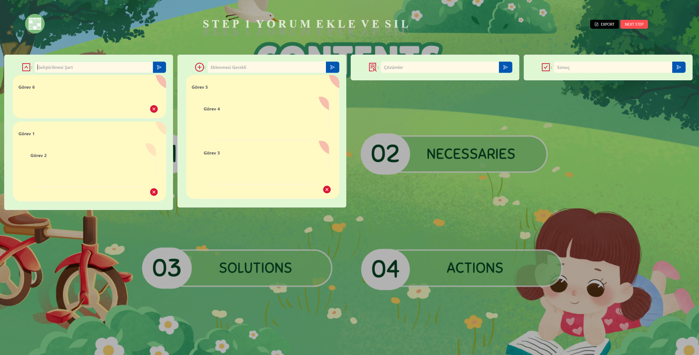

# 📌 Kanban Board (Next.js)

A modern **Kanban task management application** built with Next.js.

This project allows users to manage tasks using a visual Kanban board with draggable cards and columns.

## 🚀 Features

- Drag and drop tasks between columns
- Create new tasks
- Delete tasks
- Move tasks between workflow stages
- Interactive Kanban board UI
- Responsive layout

## 🛠️ Technologies Used

- Next.js (App Router)
- React
- TypeScript
- CSS / SCSS
- React DnD Kit
- Socket.io
- Formik, Yup
- Redux Toolkit
- Firebase
- AntDesign

## 📂 Project Structure

```
kanban-nextjs
 ├── src
    └── app
    ├── components
    ├── redux
    ├── schemas
    ├── services
    ├── styles
    ├── types
 ├── package.json
 └── README.md
```

## ⚙️ Installation

Clone the repository

```
git clone https://github.com/velidogan120/kanban-nextjs.git
```

Install dependencies

```
npm install
```

Run the development server

```
npm run dev
```

Open in browser

```
http://localhost:3000
```

## 📸 Screenshots

<p>
  
  
</p>

## 🎯 Purpose

This project was created to practice:

- Next.js App Router
- Drag and Drop UI
- Component based architecture
- State management
- Modern frontend development

## 👨‍💻 Author

Veli Doğan
https://github.com/velidogan120
